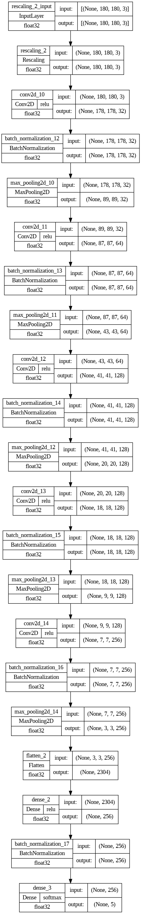

# Project Name
> To build a CNN-based model which can accurately detect melanoma. Melanoma is a type of cancer that can be deadly if not detected early. It accounts for 75% of skin cancer deaths. A solution that can evaluate images and alert dermatologists about the presence of melanoma has the potential to reduce a lot of manual effort needed in diagnosis.

## Table of Contents
* [General Info](#general-information)
* [Model Architecture](#model-architecture)
* [Technologies Used](#technologies-used)

## General Information
- The dataset consists of 2357 images of malignant and benign oncological diseases, which were formed by the International Skin Imaging Collaboration (ISIC). All images were sorted according to the classification taken with ISIC, and all subsets were divided into the same number of images, except melanomas and moles, whose images are slightly dominant.
- The data set contains the following diseases:
    - Actinic keratosis
    - Basal cell carcinoma
    - Dermatofibroma
    - Melanoma
    - Nevus
    - Pigmented benign keratosis
    - Seborrheic keratosis
    - Squamous cell carcinoma
    - Vascular lesion
- The dataset was heavily imbalanced with the 4 types contributing to more than 70% of the images.
- The Augmentor library was used to handle class imbalance, adding 500 samples per class to make sure that none of the classes were sparse.

## Model Architecture

## Technologies Used
- Tensorflow - version 2.15.0
- Python - version 3.10.12
